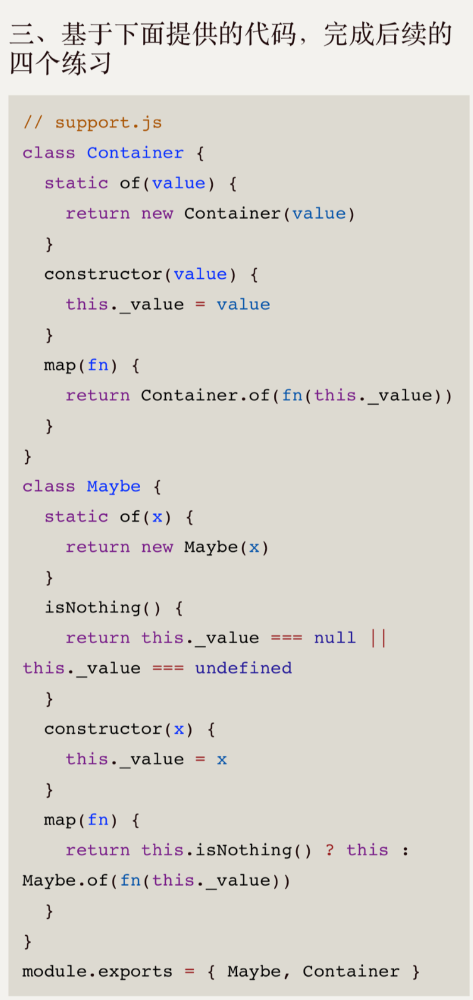
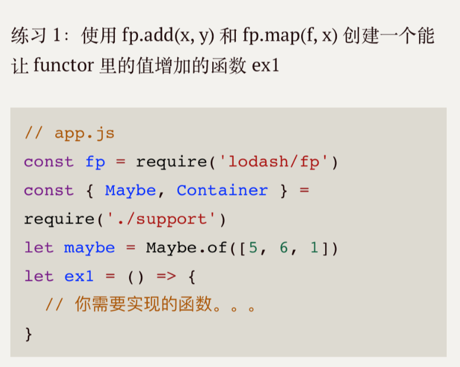
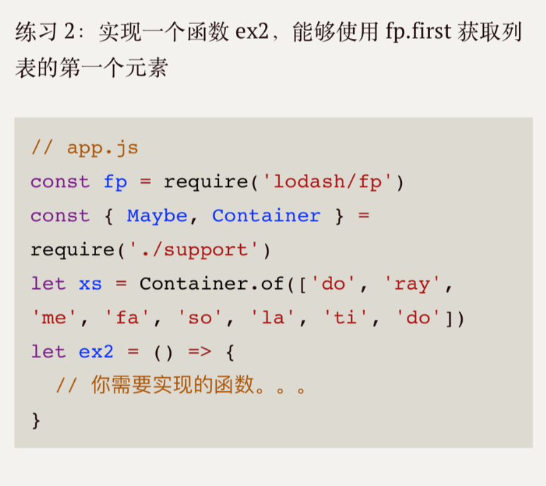
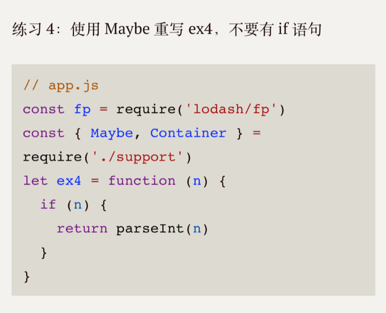

# 第三题

## 题目



### 练习 1



### 练习 2



### 练习 3


### 练习 4



```javascript
const fp = require('lodash/fp');
const { Maybe, Container } = require('./support');
const maybe = Maybe.of([5, 6, 1]);
// 练习1
const ex1 = () => {
  return maybe.map((val) => fp.map(fp.add(1), val));
};
console.log(ex1());

// 练习2
const xs = Container.of(['do', 'ray', 'me', 'fa', 'so', 'la', 'ti', 'do']);
const ex2 = () => {
  return xs.map((val) => fp.first(val));
};
console.log(ex2());

// 练习3
const safeProp = fp.curry(function (x, o) {
  return Maybe.of(o[x]);
});
const user = { id: 2, name: 'Albert' };
const ex3 = () => {
  return Container.of(user)
    .map((val) => safeProp('name', val)._value)
    .map((val) => fp.first(val));
};
console.log(ex3());

// 练习4
const ex4 = (n) => {
  return Maybe.of(n)
    .map((val) => {
      return val === '' ? undefined : val;
    })
    .map((val) => parseInt(val));
};
console.log(ex4('1'));
console.log(ex4(''));
console.log(ex4());
```
